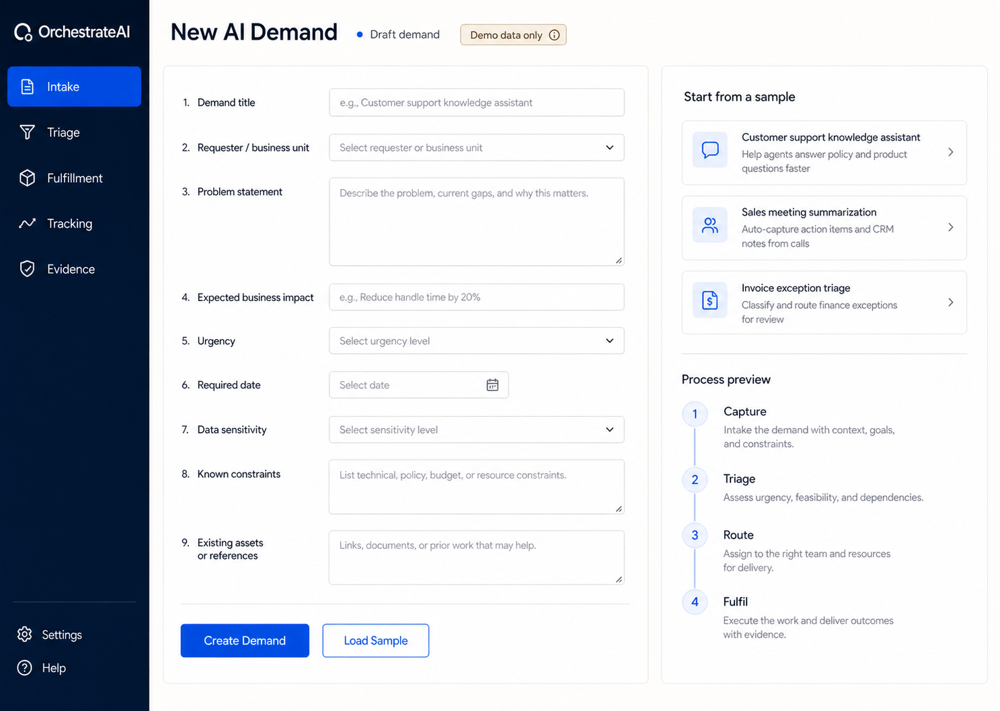
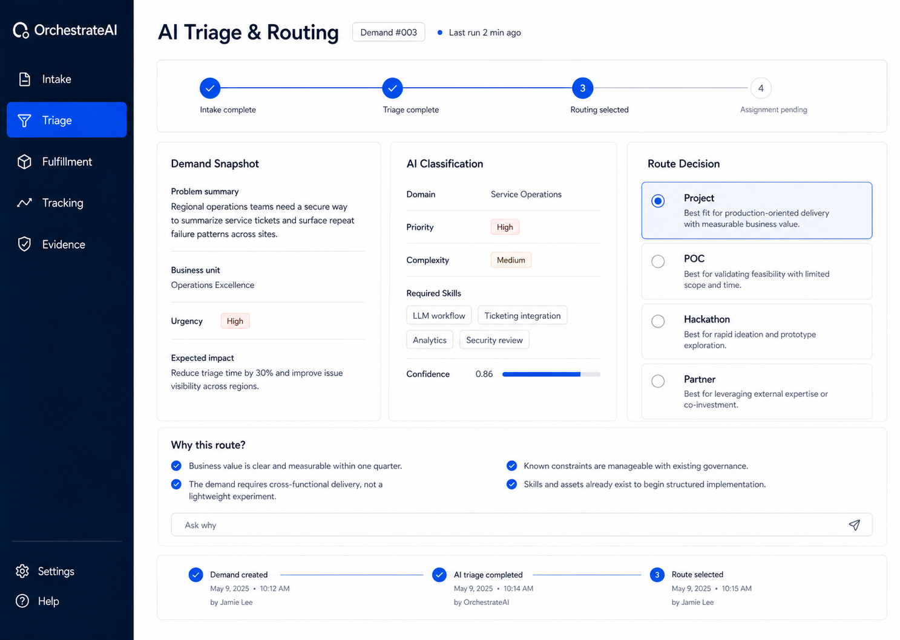
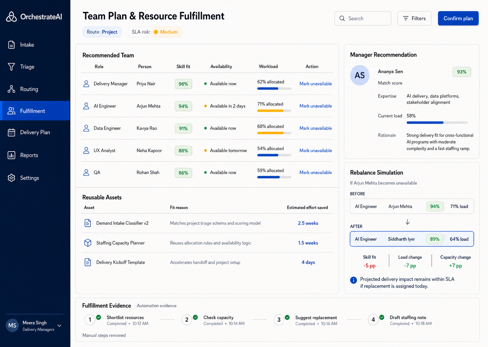

# OrchestrateAI

AI Demand Capture & Fulfilment Engine for the AI Club Demand Pipeline Hackathon.

OrchestrateAI turns a raw AI idea into an execution-ready plan: intake, AI triage, route decision, manager assignment, team matching, reusable asset recommendation, SLA tracking, notification drafts, audit trail, and explainable evidence.

## Demo

[Watch the demo video](ai_demo.mp4)

| Intake | AI Triage & Routing | Fulfilment |
|---|---|---|
|  |  |  |

## Problem We Solve

AI demand usually arrives as scattered free text, emails, calls, and manager judgment. That creates manual triage, unclear routing, slow staffing, repeated asset discovery, and weak audit evidence.

OrchestrateAI converts that into one governed pipeline:

1. Capture demand once.
2. Classify priority, complexity, domain, skills, dependencies, and sensitivity.
3. Route to Project, POC, Hackathon, or Partner.
4. Recommend the best manager and delivery team.
5. Suggest reusable accelerators before net-new work.
6. Track stages, SLA risk, decisions, and manual effort removed.
7. Explain every decision through an Ask Why interface.

## What It Does

- Single-page FastAPI dashboard with role-aware auth.
- Sample demands for quick judging and demos.
- Gemini structured analysis when `GEMINI_API_KEY` is configured.
- Deterministic fallback analysis when Gemini is unavailable.
- Explainable route scoring for Project, POC, Hackathon, and Partner paths.
- Manager recommendation using domain fit, business unit fit, skills, load, availability, and delivery score.
- Resource matching with skill fit, workload, availability, coverage score, and gap detection.
- Rebalance simulation when a team member becomes unavailable.
- Reusable asset recommendations with estimated effort saved.
- Timeline, SLA risk, bottleneck, next action, notification drafts, and audit trail.
- Ask Why endpoint for grounded decision explanations.

## Why This Fits The Hackathon

The brief asks for an AI-powered Demand Capture & Fulfilment Engine that converts AI demand into execution outcomes with minimal manual intervention.

This solution demonstrates the full lifecycle:

| Hackathon Need | OrchestrateAI Coverage |
|---|---|
| Demand capture | Guided intake form and reusable sample demands |
| AI-led triage | Gemini/fallback classification into domain, priority, complexity, skills, dependencies |
| Execution routing | Route decision with confidence, rationale, and governance steps |
| Fulfilment | Manager assignment, team plan, asset reuse, and staffing gaps |
| Tracking | Stage timeline, SLA risk, bottleneck, and next action |
| Automation evidence | Before/after manual steps removed and audit events |
| Explainability | Ask Why answers grounded in the generated pipeline state |

## Tech Stack

- FastAPI
- SQLite
- Jinja2
- Vanilla HTML/CSS/JS
- Gemini API via `google-genai` optional
- JWT auth with `PyJWT`

## Run Locally

```powershell
.\venv\Scripts\Activate.ps1
pip install -r requirements.txt
uvicorn app.main:app --reload --host 0.0.0.0 --port 8000
```

Open:

```text
http://127.0.0.1:8000
```

Default admin login:

```text
username: admin
password: admin123
```

To change the bootstrap password:

```powershell
$env:AUTH_BOOTSTRAP_PASSWORD="your-password"
```

Optional Gemini setup:

```powershell
$env:GEMINI_API_KEY="your-api-key"
```

Without Gemini, the app still works using the built-in fallback engine.

## Demo Flow

1. Sign in as `admin`.
2. Load a sample demand.
3. Create the demand.
4. Run AI Pipeline.
5. Review triage, route decision, manager, team, assets, timeline, evidence, and audit trail.
6. Mark a team member unavailable to test rebalancing.
7. Use Ask Why to explain the route and staffing decision.

## API Checks

```powershell
curl http://127.0.0.1:8000/api/health
```

Authenticated APIs include:

- `GET /api/samples`
- `POST /api/demands`
- `POST /api/demands/{demand_id}/run`
- `POST /api/demands/{demand_id}/rebalance`
- `POST /api/voice/explain`
- `GET /api/auth/me`
- `GET /api/auth/history`
- `GET /api/auth/stats`

## Project Structure

```text
app/
  main.py                 FastAPI routes and pipeline orchestration
  db.py                   SQLite schema and persistence
  services/
    gemini_service.py     AI/fallback demand analysis and explanations
    decision_engine.py    Routing and manager recommendation
    matching_engine.py    Team matching, assets, and rebalancing
    tracking_engine.py    Timeline, SLA risk, and automation evidence
    notification_service.py
  static/                 Dashboard CSS and JavaScript
  templates/              Jinja2 app shell
refs/                     README screenshots
problem_statement/        Hackathon brief
ai_demo.mp4               Demo video
```

## Notes

- Uses demo/seed data only.
- Notification content is drafted for review; nothing is sent automatically.
- SQLite database is created under `instance/`.
